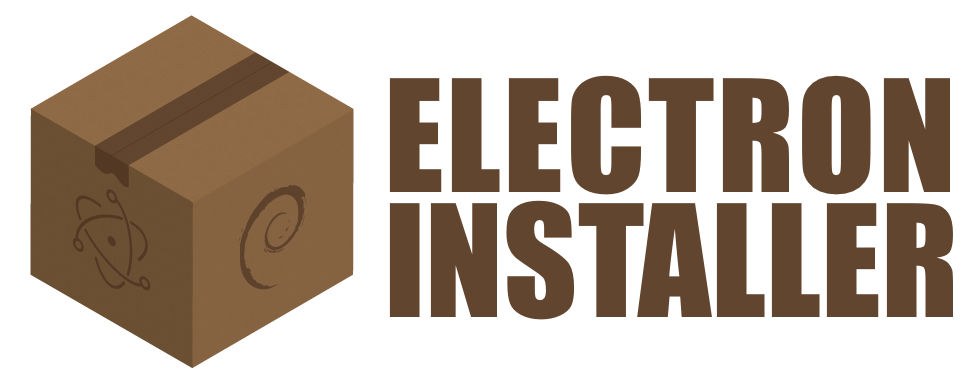

# electron-installer-debian [](https://www.npmjs.com/package/electron-installer-debian) [](http://travis-ci.org/unindented/electron-installer-debian) [](https://gemnasium.com/unindented/electron-installer-debian)

> Create a Debian package for your Electron app.


## Requirements

This tool requires `fakeroot` and `dpkg` to build the `.deb` package.

I'd recommend building your packages on your target platform, but if you insist on using Mac OS X, you can install these tools through [Homebrew](http://brew.sh/):

```
$ brew install fakeroot dpkg
```


## Installation

For use from command-line:

```
$ npm install -g electron-installer-debian
```

For use in npm scripts or programmatically:

```
$ npm install --save-dev electron-installer-debian
```


## Usage

Say your Electron app lives in `path/to/app`, and has a structure like this:

```
.
├── LICENSE
├── README.md
├── node_modules
│   ├── electron-packager
│   └── electron-prebuilt
├── package.json
├── resources
│   ├── Icon.png
│   ├── IconTemplate.png
│   └── IconTemplate@2x.png
└── src
    ├── index.js
    ├── main
    │   └── index.js
    └── renderer
        ├── index.html
        └── index.js
```

You now run `electron-packager` to build the app for Debian:

```
$ electron-packager . app --platform linux --arch x64 --out dist/
```

And you end up with something like this in your `dist` folder:

```
.
└── dist
    └── app-linux-x64
        ├── LICENSE
        ├── LICENSES.chromium.html
        ├── content_shell.pak
        ├── app
        ├── icudtl.dat
        ├── libgcrypt.so.11
        ├── libnode.so
        ├── locales
        ├── natives_blob.bin
        ├── resources
        ├── snapshot_blob.bin
        └── version
```

How do you turn that into a Debian package that your users can install?

### Command-Line

If you want to run `electron-installer-debian` straight from the command-line, install the package globally:

```
$ npm install -g electron-installer-debian
```

And point it to your built app:

```
$ electron-installer-debian --src dist/app-linux-x64/ --dest dist/installers/ --arch amd64
```

You'll end up with the package at `dist/installers/app_0.0.1_amd64.deb`.

### Scripts

If you want to run `electron-installer-debian` through npm, install the package locally:

```
$ npm install --save-dev electron-installer-debian
```

Edit the `scripts` section of your `package.json`:

```js
{
  "name": "app",
  "description": "An awesome app!",
  "version": "0.0.1",
  "scripts": {
    "start": "electron .",
    "build": "electron-packager . app --platform linux --arch x64 --out dist/",
    "deb64": "electron-installer-debian --src dist/app-linux-x64/ --dest dist/installers/ --arch amd64"
  },
  "devDependencies": {
    "electron-installer-debian": "*",
    "electron-packager": "*",
    "electron-prebuilt": "*"
  }
}
```

And run the script:

```
$ npm run deb64
```

You'll end up with the package at `dist/installers/app_0.0.1_amd64.deb`.

### Programmatically

Install the package locally:

```
$ npm install --save-dev electron-installer-debian
```

And write something like this:

```js
var installer = require('electron-installer-debian')

var options = {
  src: 'dist/app-linux-x64/',
  dest: 'dist/installers/',
  arch: 'amd64'
}

console.log('Creating package (this may take a while)')

installer(options, function (err) {
  if (err) {
    console.error(err, err.stack)
    process.exit(1)
  }

  console.log('Successfully created package at ' + options.dest)
})
```

You'll end up with the package at `dist/installers/app_0.0.1_amd64.deb`.

### Options

Even though you can pass most of these options through the command-line interface, it may be easier to create a configuration file:

```js
{
  "dest": "dist/installers/",
  "icon": "resources/Icon.png",
  "categories": [
    "Utility"
  ],
  "lintianOverrides": [
    "changelog-file-missing-in-native-package"
  ]
}
```

And pass that instead with the `config` option:

```
$ electron-installer-debian --src dist/app-linux-x64/ --arch amd64 --config config.json
```

Anyways, here's the full list of options:

#### src
Type: `String`
Default: `undefined`

Path to the folder that contains your built Electron application.

#### dest
Type: `String`
Default: `undefined`

Path to the folder that will contain your Debian installer.

#### rename
Type: `Function`
Default: `function (dest, src) { return path.join(dest, src); }`

Function that renames all files generated by the task just before putting them in your `dest` folder.

#### options.name
Type: `String`
Default: `package.name`

Name of the package (e.g. `atom`), used in the [`Package` field of the `control` specification](https://www.debian.org/doc/debian-policy/ch-controlfields.html#s-f-Package).

According to the *Debian Policy Manual*:

> Package names [...] must consist only of lower case letters (a-z), digits (0-9), plus (+) and minus (-) signs, and periods (.). They must be at least two characters long and must start with an alphanumeric character.

#### options.productName
Type: `String`
Default: `package.productName || package.name`

Name of the application (e.g. `Atom`), used in the [`Name` field of the `desktop` specification](http://standards.freedesktop.org/desktop-entry-spec/desktop-entry-spec-latest.html).

#### options.genericName
Type: `String`
Default: `package.genericName || package.productName || package.name`

Generic name of the application (e.g. `Text Editor`), used in the [`GenericName` field of the `desktop` specification](http://standards.freedesktop.org/desktop-entry-spec/desktop-entry-spec-latest.html).

#### options.description
Type: `String`
Default: `package.description`

Short description of the application, used in the [`Description` field of the `control` specification](https://www.debian.org/doc/debian-policy/ch-controlfields.html#s-f-Description).

#### options.productDescription
Type: `String`
Default: `package.productDescription || package.description`

Long description of the application, used in the [`Description` field of the `control` specification](https://www.debian.org/doc/debian-policy/ch-controlfields.html#s-f-Description).

#### options.version
Type: `String`
Default: `package.version`

Version number of the package, used in the [`Version` field of the `control` specification](https://www.debian.org/doc/debian-policy/ch-controlfields.html#s-f-Version).

#### options.revision
Type: `String`
Default: `package.revision`

Revision number of the package, used in the [`Version` field of the `control` specification](https://www.debian.org/doc/debian-policy/ch-controlfields.html#s-f-Version).

#### options.section
Type: `String`
Default: `"utils"`

Application area into which the package has been classified, used in the [`Section` field of the `control` specification](https://www.debian.org/doc/debian-policy/ch-controlfields.html#s-f-Section).

You can read more about [sections](https://www.debian.org/doc/debian-policy/ch-archive.html#s-subsections), and also check out the [list of existing sections in Debian unstable](https://packages.debian.org/unstable/).

#### options.priority
Type: `String`
Default: `"optional"`

How important it is that the user have the package installed., used in the [`Priority` field of the `control` specification](https://www.debian.org/doc/debian-policy/ch-controlfields.html#s-f-Priority).

You can read more about [priorities](https://www.debian.org/doc/debian-policy/ch-archive.html#s-priorities).

#### options.arch
Type: `String`
Default: `undefined`

Machine architecture the package is targeted to, used in the [`Architecture` field of the `control` specification](https://www.debian.org/doc/debian-policy/ch-controlfields.html#s-f-Architecture).

For possible values see the output of `dpkg-architecture -L`.

#### options.size
Type: `Integer`
Default: `size of the folder`

Estimate of the total amount of disk space required to install the named package, used in the [`Installed-Size` field of the `control` specification](https://www.debian.org/doc/debian-policy/ch-controlfields.html#s-f-Installed-Size).

#### options.depends et al
Type: `Array[String]`
Default: `[]`

Relationships to other packages, used in the [`Depends`, `Recommends`, `Suggests`, `Enhances` and `Pre-Depends` fields of the `control` specification](https://www.debian.org/doc/debian-policy/ch-relationships.html#s-binarydeps).

#### options.maintainer
Type: `String`
Default: `package.author.name <package.author.email>`

Maintainer of the package, used in the [`Maintainer` field of the `control` specification](https://www.debian.org/doc/debian-policy/ch-controlfields.html#s-f-Maintainer).

#### options.homepage
Type: `String`
Default: `package.homepage || package.author.url`

URL of the homepage for the package, used in the [`Homepage` field of the `control` specification](https://www.debian.org/doc/debian-policy/ch-controlfields.html#s-f-Homepage).

#### options.bin
Type: `String`
Default: `package.name`

Relative path to the executable that will act as binary for the application, used in the [`Exec` field of the `desktop` specification](http://standards.freedesktop.org/desktop-entry-spec/desktop-entry-spec-latest.html).

The generated package will contain a symlink `/usr/bin/<%= options.name %>` pointing to the path provided here.

For example, providing this configuration:

```js
{
  src: '...',
  dest: '...',
  name: 'foo',
  bin: 'resources/cli/launcher.sh'
}
```

Will create a package with the following symlink:

```
usr/bin/foo@ -> ../share/foo/resources/cli/launcher/sh
```

And a desktop specification with the following `Exec` key:

```
Exec=foo %U
```

#### options.icon
Type: `String` or `Object[String:String]`
Default: `undefined`

Path to a single image that will act as icon for the application:

```js
{
  icon: 'resources/Icon.png'
}
```

Or multiple images with their corresponding resolutions:

```js
{
  icon: {
    '48x48': 'resources/Icon48.png',
    '64x64': 'resources/Icon64.png',
    '128x128': 'resources/Icon128.png',
    '256x256': 'resources/Icon256.png'
  }
}
```

#### options.categories
Type: `Array[String]`
Default: `[]`

Categories in which the application should be shown in a menu, used in the [`Categories` field of the `desktop` specification](http://standards.freedesktop.org/desktop-entry-spec/desktop-entry-spec-latest.html).

For possible values check out the [Desktop Menu Specification](http://standards.freedesktop.org/menu-spec/latest/apa.html).

#### options.mimeType
Type: `Array[String]`
Default: `[]`

MIME types the application is able to open, used in the [`MimeType` field of the `desktop` specification](http://standards.freedesktop.org/desktop-entry-spec/desktop-entry-spec-latest.html).

#### options.lintianOverrides
Type: `Array[String]`
Default: `[]`

You can use these to quieten [`lintian`](https://lintian.debian.org/manual/).


## Meta

* Code: `git clone git://github.com/unindented/electron-installer-debian.git`
* Home: <https://github.com/unindented/electron-installer-debian/>


## Contributors

* Daniel Perez Alvarez ([unindented@gmail.com](mailto:unindented@gmail.com))


## License

Copyright (c) 2016 Daniel Perez Alvarez ([unindented.org](https://unindented.org/)). This is free software, and may be redistributed under the terms specified in the LICENSE file.
