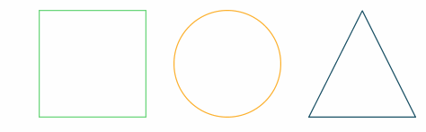

# ProgressBar.js

 

 
Responsive and slick progress bars with animated SVG paths.
Use built-in shapes or [create your own paths](http://progressbarjs.readthedocs.org/en/latest/api/path).
[Customize](http://progressbarjs.readthedocs.org/en/latest/api/parameters#custom-animations) the animations as you wish.

Documentation is [hosted at readthedocs.org](http://progressbarjs.readthedocs.org/en/latest/).

**Shortcuts**

* [Get started](http://progressbarjs.readthedocs.org/en/latest/)
* [Demo & Examples](https://kimmobrunfeldt.github.io/progressbar.js)
* [**Try** in JSFiddle](http://jsfiddle.net/kimmobrunfeldt/8xa87k31/392/)
* [API documentation](http://progressbarjs.readthedocs.org/en/latest/api/shape)
* [Migration between versions](http://progressbarjs.readthedocs.org/en/latest/#migrations)
* [react-progressbar.js](https://github.com/kimmobrunfeldt/react-progressbar.js) progress bars in React.

**Build status**

 *Build status and browser tests for current master*

# Contributing

See [documentation for contributors](http://progressbarjs.readthedocs.org/en/latest/contributing/).

# Thanks

This project is a grateful recipient of the [Futurice Open Source sponsorship program](http://futurice.com/blog/sponsoring-free-time-open-source-activities?utm_source=github&utm_medium=spice&utm_campaign=progressbar).
