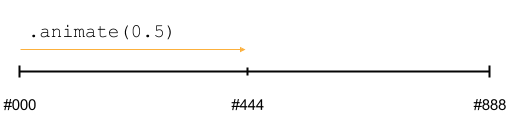

# Easing

Easing functions [provided with *shifty* are supported](https://github.com/jeremyckahn/shifty/blob/master/src/shifty.formulas.js).

A few basic easing options:

* `'linear'`
* `'easeIn'`
* `'easeOut'`
* `'easeInOut'`

You can also provide an custom easing function.

# {custom-animations} Custom animations

See [example in demo page](https://kimmobrunfeldt.github.io/progressbar.js#example-custom-animation).

Customizing animations is possible with the help of `from`, `to` and `step` parameters.
Tweening engine changes defined values over time and calls step function for each animation's frame.

!!! note
    There's a big difference between passing the `from` and `to` parameters in initialization
    of progress bar compared to passing in `.animate()` call. Here's example code and illustrations to explain the difference:

**Pass in initialization**

```javascript
var bar = new ProgressBar.Line('#container', {
    from: { color: '#000 '},
    to: { color: '#888 '},
    step: function(state, bar, attachment) {
        bar.path.setAttribute('stroke', state.color);
    }
});
```




**Pass in `.animate()` call**

```javascript
var bar = new ProgressBar.Line('#container', {
    step: function(state, bar, attachment) {
        bar.path.setAttribute('stroke', state.color);
    }
});

var opts = {
    from: { color: '#000 '},
    to: { color: '#888'}
};
bar.animate(0.5, opts);
```


## `from` parameter

Object containing values which should be tweened.

These values represent the starting values of the animation. Default: `{}`.

For example

```javascript
{
    // Start from thin gray line
    width: 0.1,
    color: '#eee'
}
```

Thanks to shifty, you can tween values in formats like `translateX(45px)`, `rgb(0,255,0)` and `#fff`.
See all supported string formats from [shifty's documentation](http://jeremyckahn.github.io/shifty/dist/doc/modules/Tweenable.token.html)

Easing defined as option for animation applies to all of the specified values.


## `to` parameter

Object containing values which should be tweened. These represent the final values after animation is done. Default: `{}`.

For example

```javascript
{
    // Finish to thick black line
    width: 1,
    color: '#000'
}
```

*Signature must match `from`*


## `step` parameter

Function called for each animation step. Tweened values, a reference to the path or shape, and an attachment are passed as parameters. Attachment can be reference to any object you need to modify within step function. Default: `function() {}`.

!!! warning
    This function is called multiple times per second.
    To make sure animations run smoothly, keep it minimal.

For example

```javascript
function(state, shape, attachment) {
    shape.path.setAttribute('stroke-width', state.width);
    shape.path.setAttribute('stroke', state.color);
    attachment.text.innerHTML = shape.value() * 100;
}
```
